# System Architecture — Nunu Prediction Market Scanner

> **Visual architecture document.** All diagrams use Mermaid. Every component, every data flow, every async boundary is mapped.

---

## 1. Generic System Architecture (High-Level)

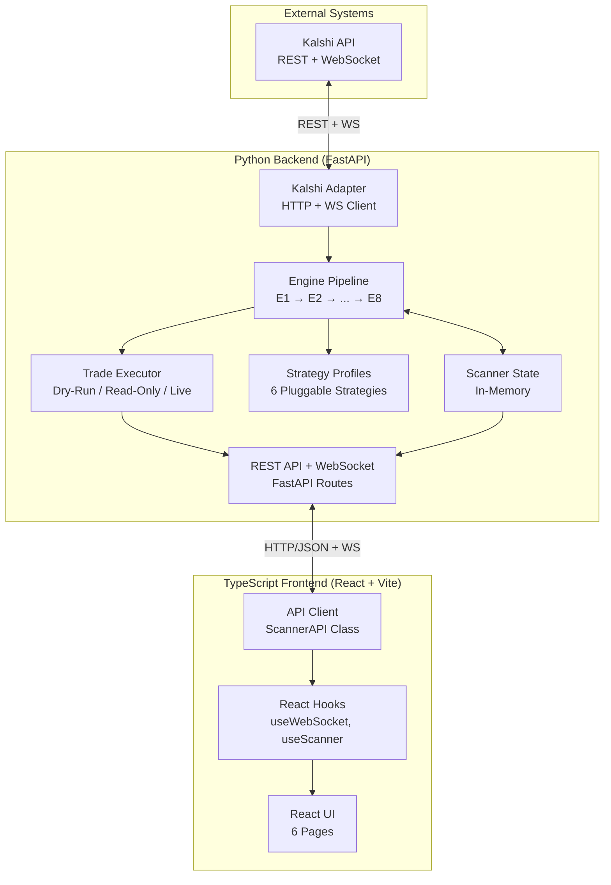

### Key

| Element | Technology | Role |
|---------|-----------|------|
| Kalshi API | External REST + WS | Source of market data |
| Kalshi Adapter | Python/httpx/websockets | Protocol translation, rate limiting |
| Engine Pipeline | Python asyncio | 8 sequential processing stages |
| Scanner State | Python dicts | In-memory runtime state |
| Strategy Profiles | Python ABC | Pluggable market/side selection |
| Trade Executor | Python | Mode-aware order placement |
| FastAPI | Python | REST + WebSocket server |
| React UI | TypeScript/Vite | Browser dashboard |
| React Hooks | TypeScript | State management, WS integration |
| API Client | TypeScript | Type-safe HTTP client |

---

## 2. Backend Architecture — Deep Dive

### 2.1 Module Dependency Hierarchy

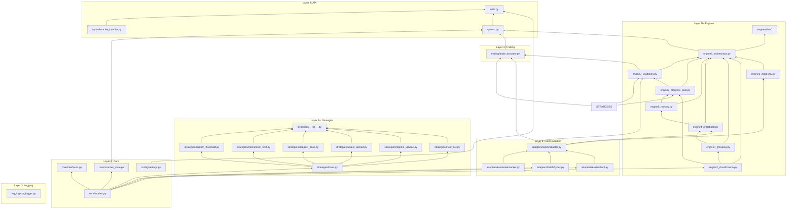

### 2.2 Engine Pipeline — Detailed Flow

```mermaid
flowchart LR
    subgraph Input["Input"]
        direction LR
        KALSHI_API["Kalshi<br/>REST API"]
    end

    subgraph Pipeline["8-Engine Pipeline (sequential)"]
        direction TB
        
        E1["Engine 1<br/>Market Discovery<br/><i>fetch_all_open_markets()</i>"]
        E2["Engine 2<br/>Live Classification<br/><i>classify_same_day_live()</i>"]
        E3["Engine 3<br/>Event Grouping<br/><i>group_by_event_ticker()</i>"]
        E4["Engine 4<br/>Orderbook Fetch<br/><i>fetch_orderbooks()</i>"]
        E5["Engine 5<br/>Market Ranking<br/><i>rank_by_resting_orders()</i>"]
        E6["Engine 6<br/>Progress Gate<br/><i>select_market + select_side</i>"]
        E7["Engine 7<br/>Pre-Trade Validate<br/><i>re-validate live data</i>"]
        E8["Engine 8<br/>Orchestration<br/><i>coordinate + dispatch</i>"]
    end

    subgraph Output["Output"]
        direction LR
        CANDIDATES["Order Candidates"]
        EVENTS["Ranked Events"]
        TRADES["Trade Records"]
    end

    KALSHI_API --> E1
    E1 --> E2
    E2 --> E3
    E3 --> E4
    E4 --> E5
    E5 --> E6
    E6 --> E7
    E7 --> E8
    E8 --> CANDIDATES
    E8 --> EVENTS
    E8 --> TRADES

    style E1 fill:#4A90D9,color:#fff
    style E2 fill:#4A90D9,color:#fff
    style E3 fill:#4A90D9,color:#fff
    style E4 fill:#4A90D9,color:#fff
    style E5 fill:#4A90D9,color:#fff
    style E6 fill:#F5A623,color:#fff
    style E7 fill:#D0021B,color:#fff
    style E8 fill:#7ED321,color:#fff
```

### 2.3 Engine Data Flow — Types In/Out

```mermaid
flowchart LR
    E1["Engine 1"] -->|"list[Market]"| E2
    E2["Engine 2"] -->|"list[tuple[Market, Classification]]"| E3
    E3["Engine 3"] -->|"list[ClassifiedEvent]"| E4
    E4["Engine 4"] -->|"list[tuple[ClassifiedEvent, dict[str, Orderbook]]]"| E5
    E5["Engine 5"] -->|"list[EventWithTopMarkets]"| E6
    E6["Engine 6"] -->|"list[ProgressBasedOrderCandidate]"| E7
    E7["Engine 7"] -->|"list[ValidatedOrderCandidate]"| E8
    E8["Engine 8"] -->|"ScannerResult"| API["API Layer"]

    style E1 fill:#4A90D9,color:#fff
    style E2 fill:#4A90D9,color:#fff
    style E3 fill:#4A90D9,color:#fff
    style E4 fill:#4A90D9,color:#fff
    style E5 fill:#4A90D9,color:#fff
    style E6 fill:#F5A623,color:#fff
    style E7 fill:#D0021B,color:#fff
    style E8 fill:#7ED321,color:#fff
```

### 2.4 Strategy Resolution

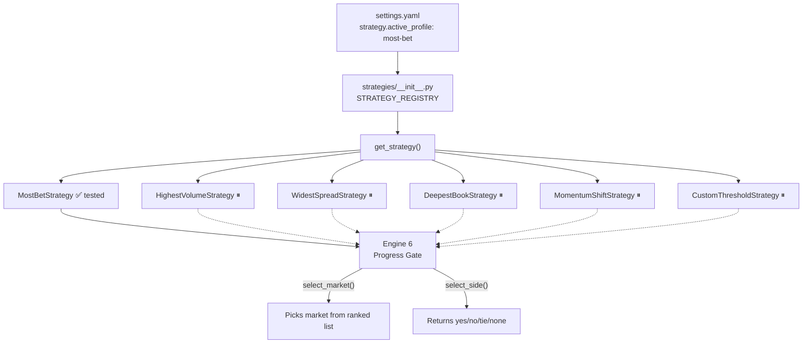

---

## 3. Async Runtime Architecture

### 3.1 One-Shot Mode (Synchronous Pipeline)

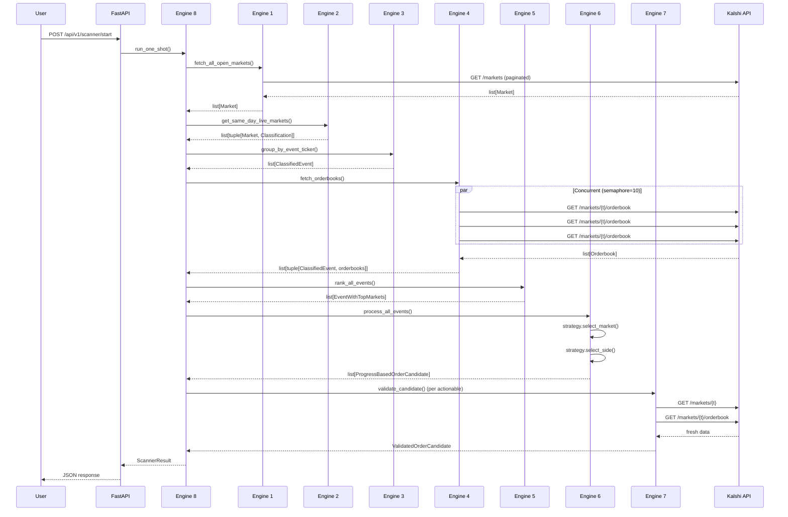

### 3.2 Live Mode (Async Event Loop)

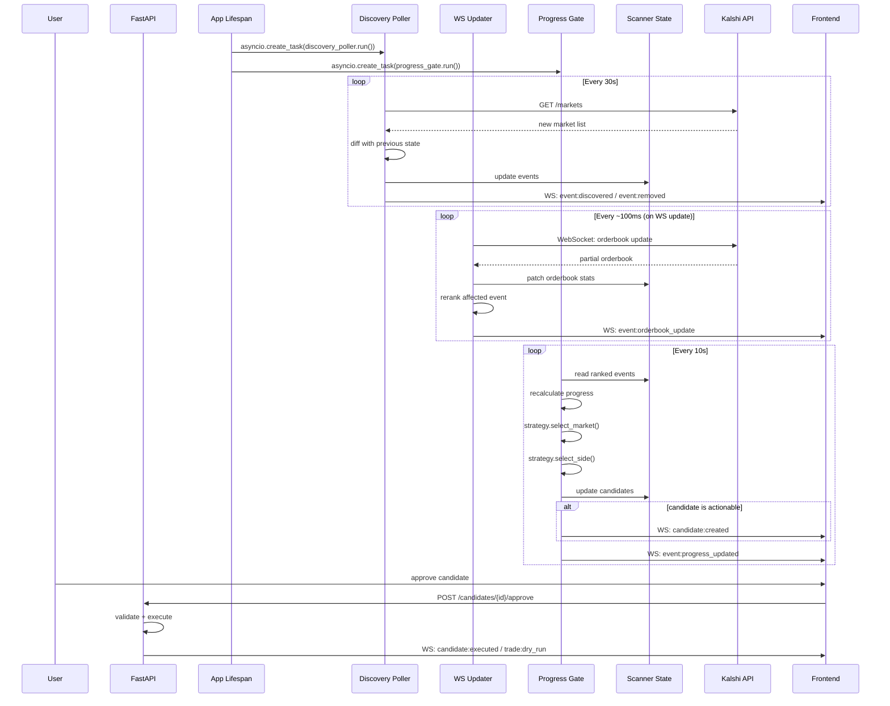

### 3.3 Async Task Graph

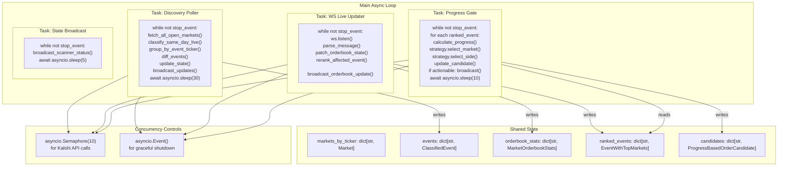

### 3.4 State Synchronization

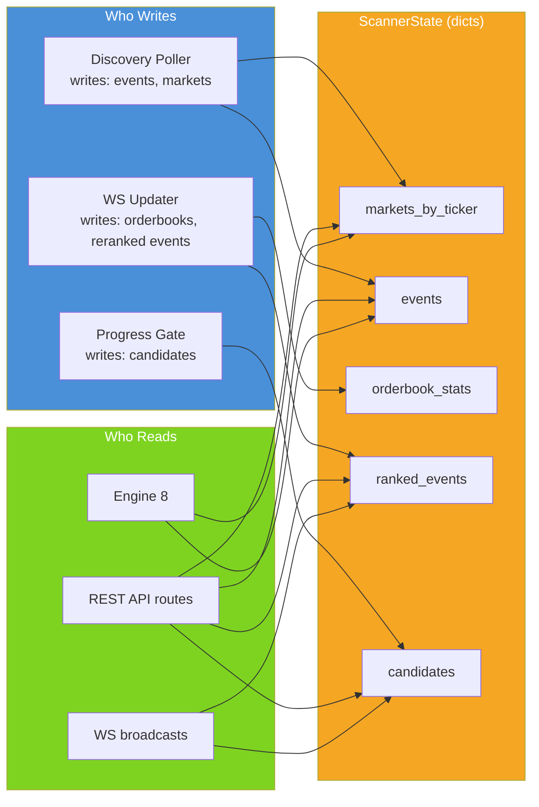

---

## 4. Frontend Architecture — Deep Dive

### 4.1 Component Tree

```mermaid
graph TB
    APP["App.tsx<br/>BrowserRouter + Layout"]
    
    subgraph Pages["Pages (6 routes)"]
        DASH["Dashboard.tsx<br/>Route: /"]
        EVENTS["Events.tsx<br/>Route: /events"]
        EVENT_DETAIL["EventDetail.tsx<br/>Route: /events/:id"]
        CAND["Candidates.tsx<br/>Route: /candidates"]
        TRADES["Trades.tsx<br/>Route: /trades"]
        SETTINGS["Settings.tsx<br/>Route: /settings"]
    end
    
    subgraph Hooks["Custom Hooks"]
        useWS["useWebSocket(channel, handler)"]
        useSC["useScanner()"]
        useCAND["useCandidates()"]
    end
    
    subgraph Lib["Library"]
        API["api.ts<br/>ScannerAPI class"]
        TYPES["types.ts<br/>All interfaces"]
        CONST["constants.ts"]
    end
    
    subgraph Components["Reusable Components"]
        direction TB
        
        subgraph Dashboard_Group["Dashboard"]
            EC["EventCard.tsx"]
            EL["EventList.tsx"]
            MR["MarketRow.tsx"]
            SS["ScannerStatus.tsx"]
        end
        
        subgraph Orderbook_Group["Orderbook"]
            OD["OrderbookDepth.tsx"]
            BA["BidAskChart.tsx"]
            SI["SpreadIndicator.tsx"]
        end
        
        subgraph Candidate_Group["Candidates"]
            CC["CandidateCard.tsx"]
            CL["CandidateList.tsx"]
            CA["CandidateActions.tsx"]
        end
        
        subgraph Trading_Group["Trading"]
            MS["ModeSelector.tsx"]
            CD["ConfirmDialog.tsx"]
            TH["TradeHistory.tsx"]
        end
        
        subgraph Controls_Group["Controls"]
            TS["ThresholdSlider.tsx"]
            SS2["StrategySelector.tsx"]
            RC["RefreshControl.tsx"]
        end
        
        subgraph Common_Group["Common"]
            B["Badge.tsx"]
            PB["ProgressBar.tsx"]
            SD["SideIndicator.tsx"]
        end
    end

    APP --> DASH
    APP --> EVENTS
    APP --> EVENT_DETAIL
    APP --> CAND
    APP --> TRADES
    APP --> SETTINGS
    
    DASH --> EC
    DASH --> SS
    EVENTS --> EL
    EVENT_DETAIL --> MR
    EVENT_DETAIL --> OD
    EVENT_DETAIL --> BA
    EVENT_DETAIL --> PB
    CAND --> CC
    CAND --> CL
    CAND --> CA
    TRADES --> TH
    SETTINGS --> MS
    SETTINGS --> TS
    SETTINGS --> SS2
    
    EC --> B
    EC --> PB
    EC --> SD
    MR --> SD
    MR --> SI
    CC --> B
    CC --> PB
    CC --> CA
    CA --> CD
    MS --> CD
    MS --> B

    DASH --> useWS
    DASH --> useSC
    CAND --> useCAND
    useWS --> API
    useSC --> API
    useCAND --> API
    API --> TYPES
```

### 4.2 Frontend Data Flow

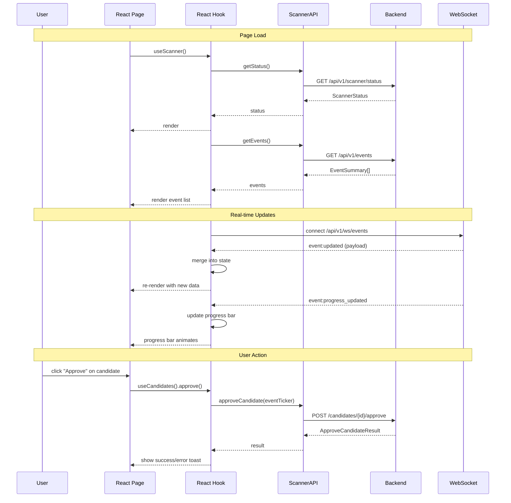

### 4.3 Frontend State Management

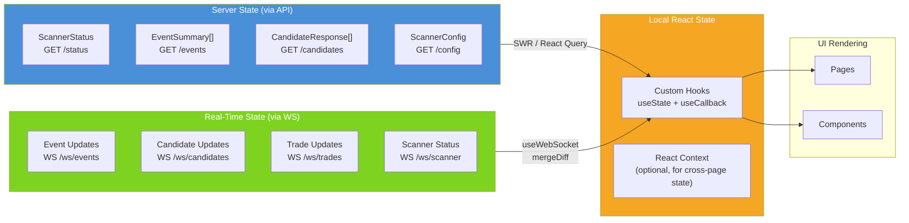

---

## 5. Three Operating Modes

### 5.1 Mode Decision Tree

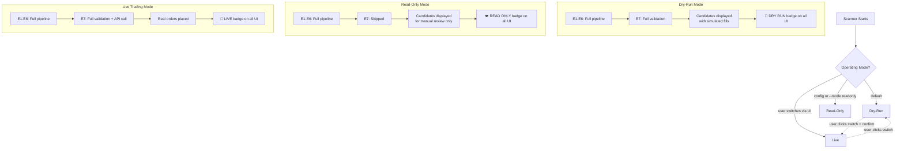

### 5.2 Mode State Machine

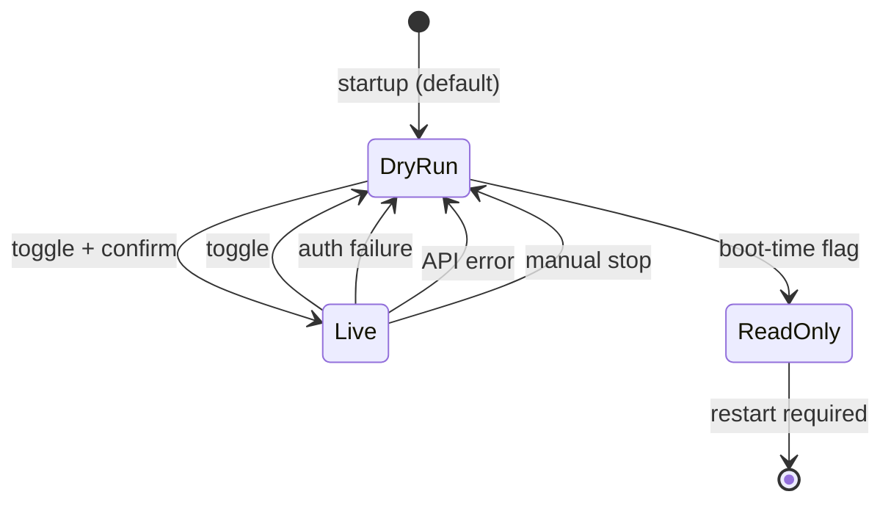

---

## 6. Deployment Architecture

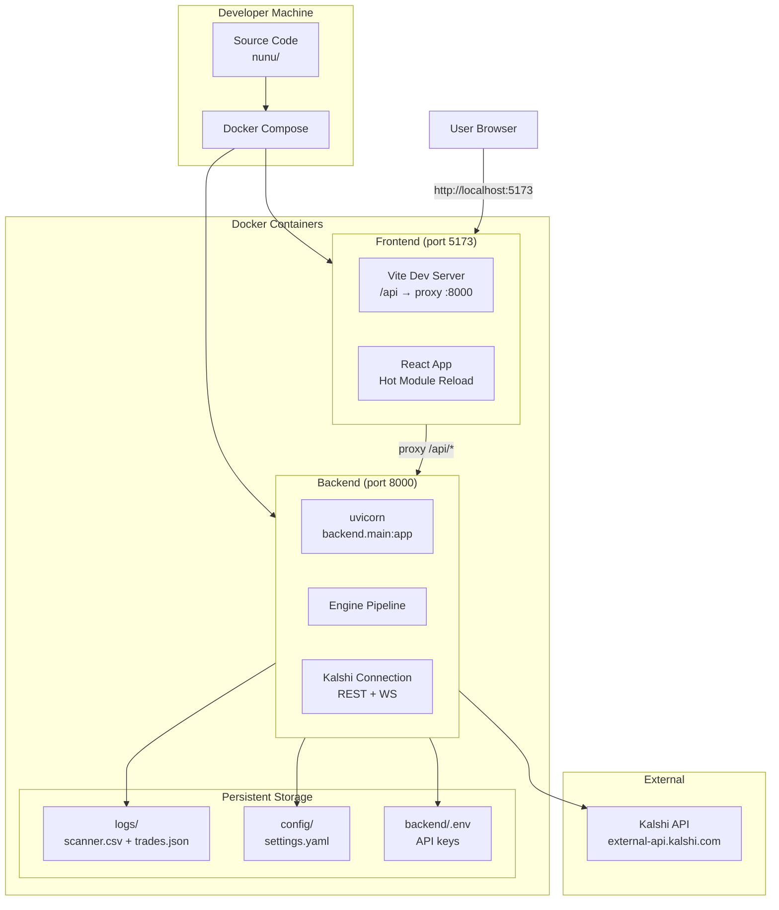

---

## 7. Data Schema Relationships

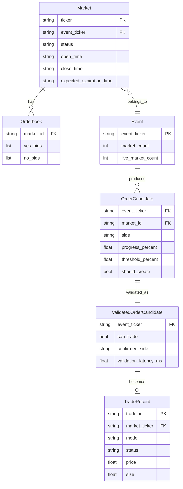

---

## 8. Security Boundaries

```mermaid
flowchart LR
    subgraph Untrusted["Untrusted Zone"]
        BROWSER["Browser<br/>(React App)"]
    end
    
    subgraph API_Boundary["API Boundary (FastAPI)"]
        CORS["CORS Middleware"]
        AUTH["Auth Check<br/>(live mode only)"]
        VALIDATION["Request Validation<br/>(Pydantic)"]
        RATE_LIMIT["Rate Limiter"]
    end
    
    subgraph Trusted["Trusted Zone"]
        ENGINES["Engine Pipeline"]
        ADAPTER["Kalshi Adapter"]
    end
    
    subgraph External["External"]
        KALSHI["Kalshi API"]
    end

    BROWSER -->|"HTTP/WS"| CORS
    CORS --> AUTH
    AUTH --> VALIDATION
    VALIDATION --> RATE_LIMIT
    RATE_LIMIT --> ENGINES
    ENGINES --> ADAPTER
    ADAPTER -->|"HTTPS + API Key"| KALSHI

    style Untrusted fill:#ffcccc
    style API_Boundary fill:#ffffcc
    style Trusted fill:#ccffcc
    style External fill:#e0e0e0
```

---

## 9. Key Async Patterns

### 9.1 Concurrent Orderbook Fetching

```python
# Pattern: bounded concurrency with asyncio.Semaphore
semaphore = asyncio.Semaphore(10)

async def fetch_one(ticker: str) -> tuple[str, Orderbook]:
    async with semaphore:
        return ticker, await adapter.get_orderbook(ticker)

# Fire all requests concurrently, wait for all to complete
tasks = [fetch_one(t) for t in tickers]
results = await asyncio.gather(*tasks, return_exceptions=True)
```

### 9.2 WebSocket Auto-Reconnect

```python
# Pattern: infinite loop with reconnection
async def listen_with_reconnect(self, tickers):
    while self._running:
        try:
            await self.connect()
            await self.subscribe(tickers)
            async for message in self.listen():
                await self.handle_message(message)
        except ConnectionClosed:
            await asyncio.sleep(self.reconnect_delay)
```

### 9.3 Graceful Shutdown

```python
# Pattern: asyncio.Event for cross-task cancellation
stop_event = asyncio.Event()

async def discovery_poller():
    while not stop_event.is_set():
        await do_work()
        await asyncio.sleep(30)

async def progress_gate():
    while not stop_event.is_set():
        await do_work()
        await asyncio.sleep(10)

# On shutdown:
stop_event.set()
await asyncio.gather(*tasks, return_exceptions=True)
```

### 9.4 State Isolation (No Locks Needed)

Because all tasks run in the same event loop (asyncio single-threaded), shared state access is implicitly safe:

```python
# All tasks in same event loop = no race conditions on plain dicts
# Task 1 writes:
state.events[event_ticker] = new_event

# Task 2 reads (same thread, different await point):
current = state.events.get(event_ticker)

# No locks needed — asyncio yields only at await points
```

---

## 10. Configuration Flow

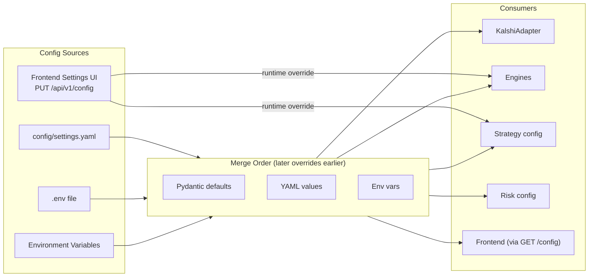

---

## Diagram Index

| Diagram | File | What It Shows |
|---------|------|---------------|
| 1. Generic System | Above | High-level backend ↔ frontend ↔ Kalshi |
| 2.1 Module Deps | Above | Every Python file, import dependencies |
| 2.2 Engine Pipeline | Above | 8 engines with colored stages |
| 2.3 Engine Data Flow | Above | Types flowing between engines |
| 2.4 Strategy Resolution | Above | Config → registry → strategy instance |
| 3.1 One-Shot Sequence | Above | Full async sequence diagram |
| 3.2 Live Mode Sequence | Above | Async event loop with 3 parallel tasks |
| 3.3 Async Task Graph | Above | asyncio task structure with shared state |
| 3.4 State Sync | Above | Writers, readers, state layer |
| 4.1 Component Tree | Above | All React components with nesting |
| 4.2 Frontend Data Flow | Above | Sequence: page → hook → API → render |
| 4.3 Frontend State | Above | Server + real-time + local state sources |
| 5.1 Mode Decision Tree | Above | 3 modes, what runs in each |
| 5.2 Mode State Machine | Above | States and transitions |
| 6. Deployment | Above | Docker, ports, volumes, external |
| 7. ER Diagram | Above | Data model relationships |
| 8. Security | Above | Trust boundaries |
| 9. Async Patterns | Above | Code snippets for key patterns |
| 10. Config Flow | Above | Config sources and merge order |
